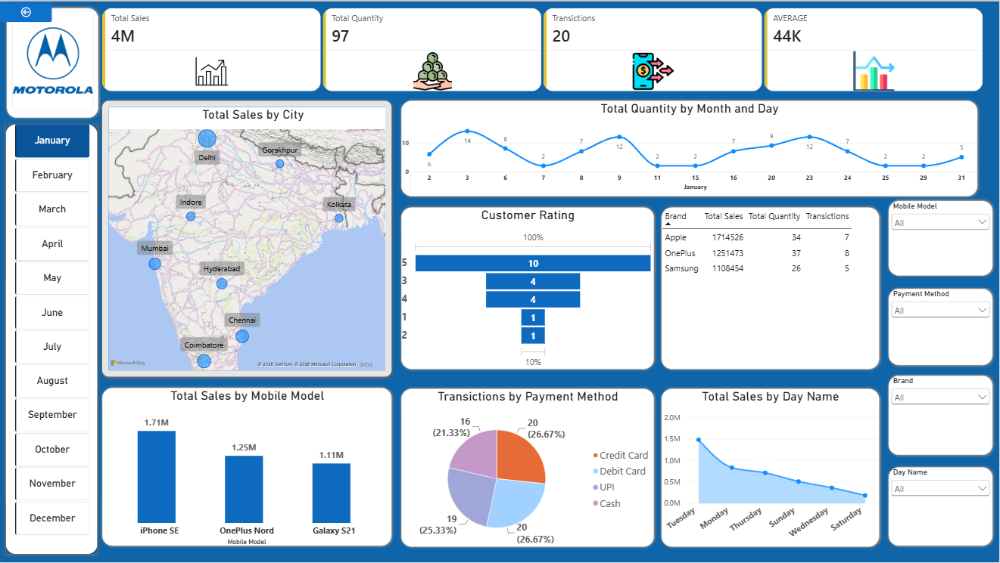

# 📱 Mobile Sales Analytics Dashboard | Power BI
## 📊 Project Overview
This project is an interactive Mobile Sales Analytics Dashboard developed using Microsoft Power BI.
The dashboard provides a clear view of mobile sales performance and helps analyze sales trends across cities, brands, mobile models, payment methods, customer ratings, months, and days.
## 🎯 Project Objective
The objective of this project is to transform mobile sales data into an interactive and easy-to-understand dashboard that can help businesses:
- Monitor overall sales performance
- Analyze sales by city
- Identify top-performing mobile models
- Compare different brands
- Understand payment method usage
- Analyze customer ratings
- Track sales trends by day and month
- Identify high-performing sales periods
## 🛠️ Tools & Technologies
- Microsoft Power BI
- Power Query
- DAX
- Microsoft Excel / CSV
- Data Visualization
## 📌 Key KPIs
The dashboard displays the following key performance indicators:
- Total Sales
- Total Quantity
- Total Transactions
- Average Sales
## 📈 Dashboard Features
### 1. Total Sales by City
Displays mobile sales performance across different cities.
### 2. Total Quantity by Month and Day
Shows sales quantity trends across different dates and months.
### 3. Customer Rating
Provides an overview of customer ratings.
### 4. Brand Analysis
Compares sales, quantity, and transactions across different mobile brands.
### 5. Mobile Model Analysis
Highlights sales performance of individual mobile models.
### 6. Payment Method Analysis
Shows transactions based on different payment methods such as:
- Credit Card
- Debit Card
- UPI
- Cash
### 7. Day-wise Sales Analysis
Analyzes total sales according to different days of the week.
### 8. Interactive Filters
Users can filter the dashboard using:
- Month
- Mobile Model
- Payment Method
- Brand
- Day Name
## 📷 Dashboard Preview

## 📁 Project Structure
```text
Mobile-Sales-PowerBI-Dashboard/
│
├── README.md
│
├── PowerBI/
│   └── Mobile_Sales_Dashboard.pbix
│
├── Dataset/
│   └── Mobile_Sales_Data.csv
│
├── Dashboard/
│   └── Mobile_Sales_Dashboard.png
│
└── Documentation/
    └── Project_Description.md
